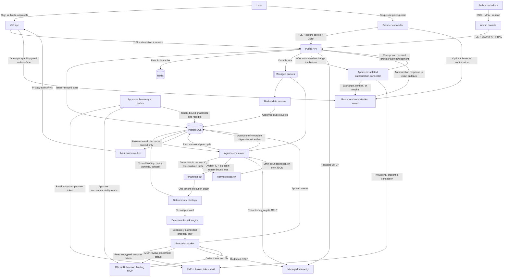

# Data-flow diagram

Pairing redirects the user to the authorization server after MCP protected-resource and authorization-server metadata discovery. On iPhone, one tap requests the same server-bound authorization and opens the validated provider destination in `ASWebAuthenticationSession`; the OAuth callback remains server-side. Authorization codes never enter application UI state. Before the connector receives an exchange request, the API commits a tenant-bound cleanup tombstone. The approved connector stores any broker access/refresh material as a provisional encrypted-vault transaction and returns only an opaque receipt. A pending connection and confirmation saga are committed next; only terminal provider confirmation may enqueue hydration, and only successful Agentic Account/capability/snapshot hydration may report Connected. Only the execution task role and a separately approved broker-sync task role may read the broker vault. The API, orchestrator, Hermes, clients, and all other workers cannot. The browser receives a sanitized result and re-fetches masked connection status. iOS keeps QR, Copy, and Share as optional ways to reopen the same short-lived authorization in another trusted browser.

Disconnect and reconnect preparation use the same durable authorization graph. Local execution authority is disabled immediately, but success is not reported until the isolated connector acknowledges provider revocation. Unknown outcomes remain queued for recovery and block replacement authorization.

Hermes receives one frozen, sorted, distinct, bounded public quote universe published for the central plan assignment—never a tenant-derived union and never user, account, portfolio, holding, risk, approval, order, or credential data. The cycle has one logical deterministic request ID, but an at-least-once retry may repeat the network invocation. PostgreSQL accepts only one immutable digest-bound sanitized artifact for that cycle.

Fan-out shares the canonical timestamp and artifact reference, not tenant authority. Each tenant job independently revalidates ownership, current plan and catalog assignment, legal consent, Agentic Account binding, broker capability discovery, portfolio and quote freshness, deterministic risk, approval, execution, and reconciliation. One tenant's failure cannot relax another tenant's controls. Hermes output is schema-validated research evidence and cannot directly reach the broker; hidden chain-of-thought is neither requested nor stored.
